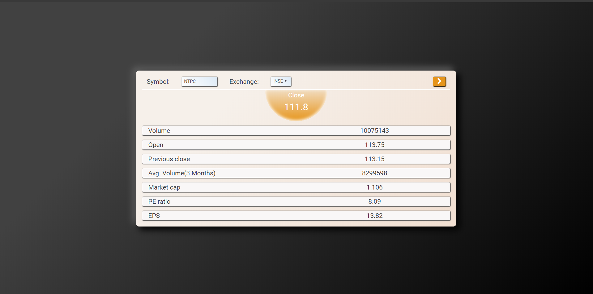

# StockApp

This Angular application acts as a demo UI for [stock-app](https://github.com/shikharka/stocks-app). It consumes the /getQuote API to fetch current quote for NSE or BSE exchange and given stock symbol.

## Quick start

```text
git clone https://github.com/shikharka/stock-ui-app.git

# change directory
cd stock-ui-app

# Install Dependencies
npm install

# Start the server
npm start
```

Application will start at http://localhost:4200

Screen-

